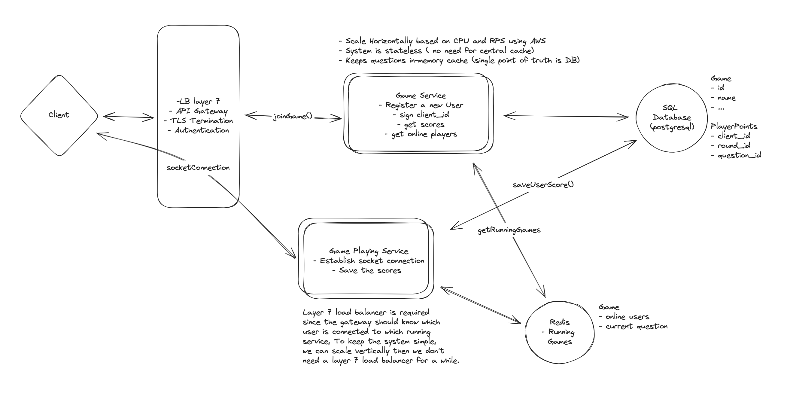

# Think Fast Quiz Game

### Functional Requirements

- Clients should be able to join the current quiz game
- The user client answers the fastest among concurrent requests will get the score
- Once a user gives the correct answer, other clients should be informed the question is gone
- Once a question is answered, next question from the lists should be provided in order
- If game is running out of questions it should cycle back to the starting point

### Out Of Scope
- Multiple concurrent game
- Invalidation of the question if no one provides the correct answer
- Retry mechanism
- Idempotency of the duplicate requests (causing by retry)

### Non-Functional Requirements
- CAP theorem ( consistency >> availability ) - only one user can provide a correct answer
- Low latency - users should be updated in real-time
- Security - users shouldn't be able to provide wrong answers for others 
- Massive current requests --> async approach
- Scalability ( Horizontally scalable )

### System Design ( out of scope partially )

What is provided within this repo is a monolithic implementation of the product to showcase my coding skills but in bellow system design 
I tried to dive in details for a more scalable system in future and the monolithic version is design in a way to be able to split into
multiple services



### How to use backend ?

    1. Open Up two clients in two seprate tabs using http://localhost:8000
    2. check if your users are online using openAPI OpenApi http://localhost:8000/docs
    3. Try to answer question ( you can see the correct answer in the client page or in sample_data.py )
    4. check the result on the client page
    5. check if the correct answer is commit in data base using OpenApi http://localhost:8000/docs

## API Reference

#### Get Client HTML Page

```http
  GET /
```

#### Get a list of all points

```http
  GET /game/points
```

#### Check all online players

```http
  GET /game/online-players
```

## Run Locally

Clone the project

```bash
  git clone git@github.com:alirezakhosraviyan/thinkfastquizgame.git
```

Go to the project directory

```bash
  cd thinkfastquizgame
```

Install dependencies (optional, if you don't already have it)

-  Install docker-compose from [here](https://www.digitalocean.com/community/tutorials/how-to-install-and-use-docker-compose-on-ubuntu-20-04)

Start all servers

```bash
  docker-compose up -d
```

Tear down the containers (Optional)
```bash
  docker-compose down -v
```

# Technical Notes

- **`Domain-Driven-Design`**: One of the non-functional requirements of the project is scalability, which led me to use Domain-Driven Design for the backend file structure. It makes the project loosely coupled and will be easier to divide into different services.

- **`AsyncIO`** : Since the code is mostly IO-bound and not CPU-bound, using async programming helps the code be faster and more responsive.

- **`Web Sockets`** : Since the users should be kept updated, websockets was used

- **`Sqlmodel`** : Helps code reusability, supported by fastapi, on top of SQLAlchemy, supports async programming, validation with pydantic

- **`Ruff`** : An extremely fast Python linter and code formatter, written in Rust 🦞, ( instead of : pylint, black, isort, etc)

- **`tests`** : Backend has enough tests to cover all APIs to showcase my skill in creating tests but surely for production ready products we can always have more tests

- **`Gitlab-CI`** : Checks the code quality and tests automatically to ensure the delivery of high-quality code.

## Tech Stack

**Server:** Python, Fastapi, Postgresql, Sqlmodel, Pydantic, Alembic, JWT, Asyncio, Pytest, Ruff (all linters), MyPy, Docker, Docker-Compose, gitlab-ci


